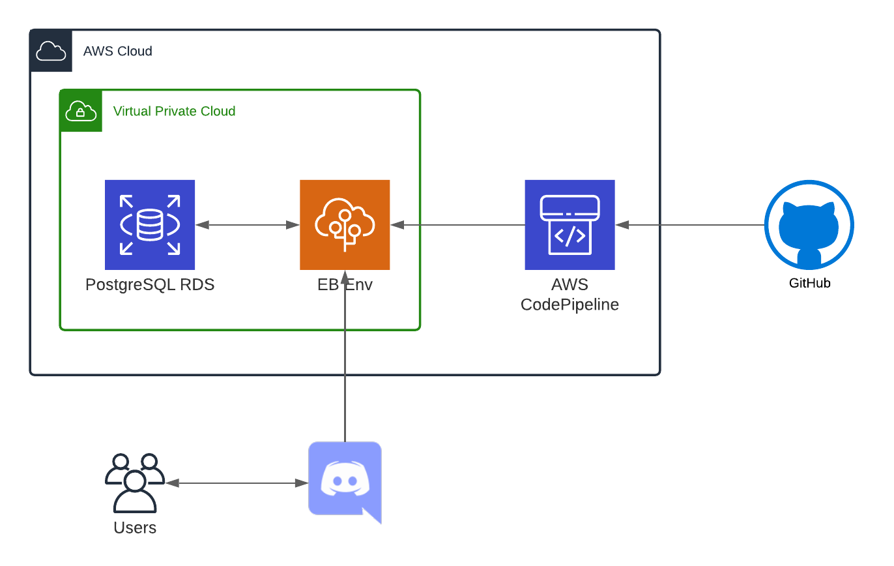

# SimpBot

This is a personal project that started as a joke. The idea was to create a bot with fun commands for me and my friends in our DIscord server. I ended up adding more complex stuff based on my friend's requests.

## AWS Set Up

* Created RDS instance: This keeps track of useless stuff we do.
* Created elasticBeanstalk environment: This is where the bot runs. Created environment inside a new VPC.
* Created IAM role for EB:
  * This needs SecretsManager read permissions.
* Created secret for RDS creds with automatic rotation, because, security.
* Created discord bot following [this](https://discordpy.readthedocs.io/en/latest/discord.html).
* Created secret with bot token.
* Added security group to DB to accept connections from my computer and from the instance in EB.
* Added security group to EB to be able to SSH.

## Database Set Up

* Run the create statements in the database directory.
* Insert discord user ids and nickanmes to the user table.

## Commands

To see command summary, you can run `!help` on the server, however, here is a more extensive description by category.

### Generic commands

* `!taylor`: Returns a random taylor song snippet.

### The Feli-Point system

The Feli-Point is an imaginary currency that me and my friends use for when we do good and bad things. Points can be added or removed and transactions are tracked in out database.

* `!felipoint`: Adds or removes a feli points to a user. This requires 3 parameters:
  * `amount`: Must be an integer number and represents the amount of points to add or subtract from a user.
  * `recipient`: Custom nickname of the user to give or subtract points from.
  * `type`: Can be only `add` or `remove`.
* `!pointbalance`: Returns balance and transaction history of feli points. This includes the balance of the past 4 weeks, the current week and a total balance, accompanied by a balance graph.
